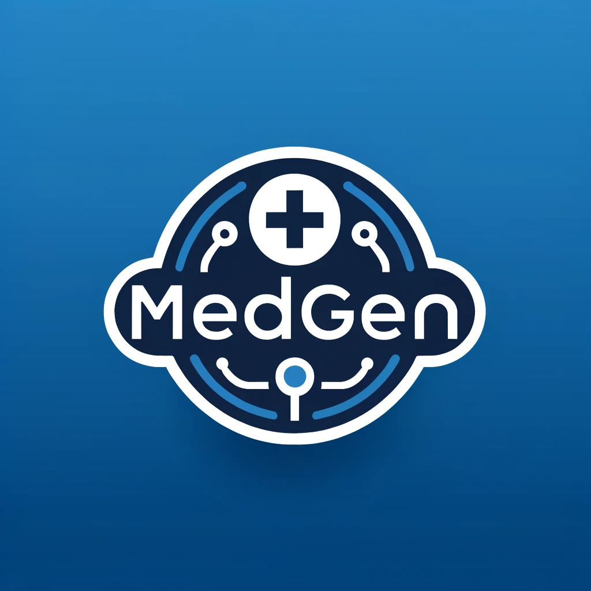
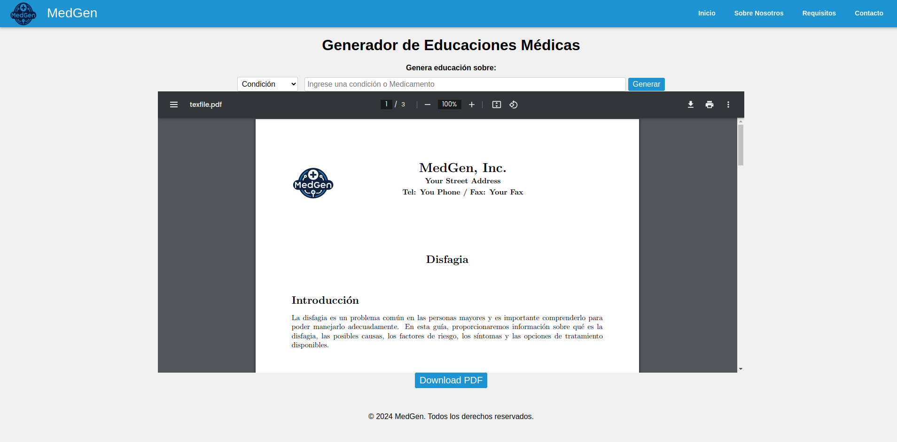

# MEDGEN - Medical Educations Generator

## Introduction

This Flask application generates structured blog posts in Spanish, English (or any other language ChatGPT can write) about medical conditions and medications, formatted for LaTeX, designed specifically for patient education aimed at elderly patients. It ensures clarity and accessibility in presenting complex medical information.

 


## Features

- **Multilingual Support**: Generate LaTeX-formatted text about medical conditions and medications in Spanish, English, and other languages supported by ChatGPT.
- **Designed for Clarity**: The text is clear and easy to understand, tailored specifically for elderly patients.
- **PDF Downloads**: Provides the capability to download the generated LaTeX documents as PDFs.

## Technology Stack

- **Backend**: Flask
- **API**: Utilizes OpenAI for dynamic content generation.
- **Text Processing**: Implemented with Python `markdown` and `transformers`.
- **Configuration Management**: Managed through `python-decouple`.

## Getting Started

Follow these instructions to get a copy of the project up and running on your local machine for development and testing purposes.

### Prerequisites

You need to have Python installed and preferably, a virtual environment to manage dependencies. Here are the steps to set up the project:

```bash
# Create a virtual environment
python3 -m venv .

# Activate the virtual environment
# On Unix or MacOS, use:
source venv/bin/activate  
# On Windows, use:
venv\Scripts\activate

# Install required dependencies
pip install -r requirements.txt

